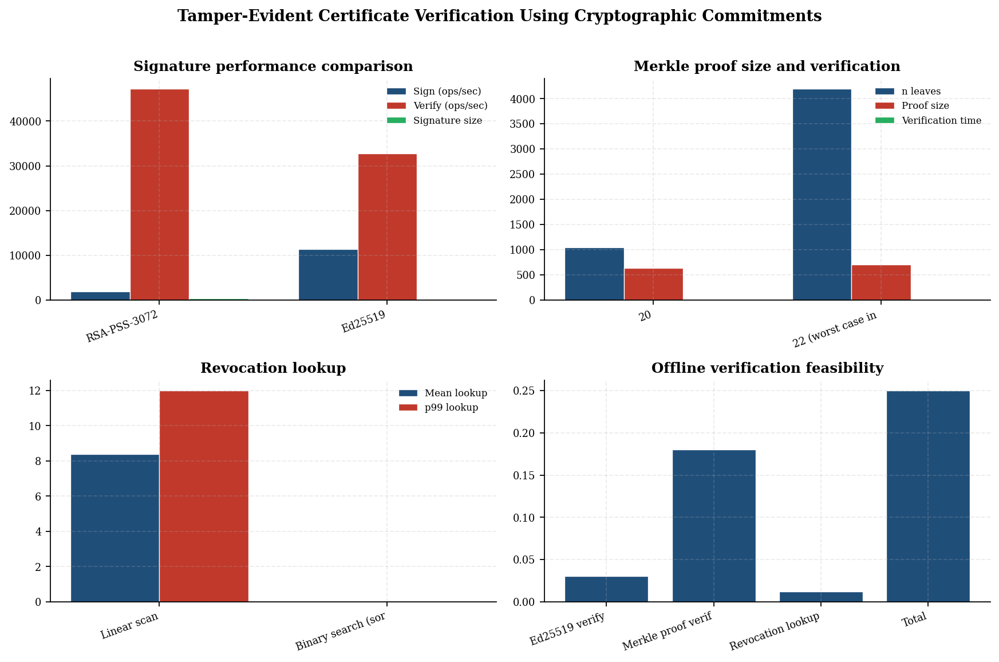
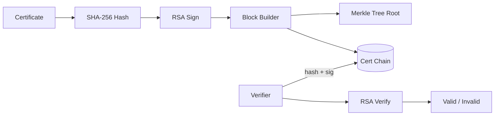
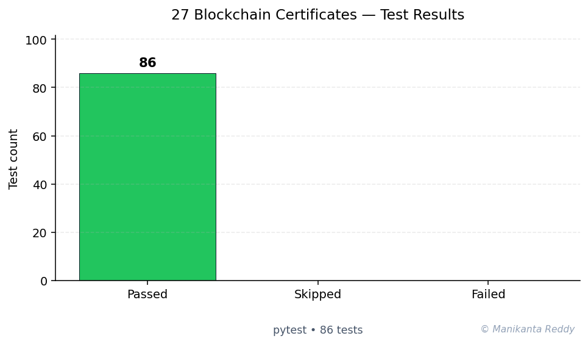

# Blockchain Certificate Verification System

<p align="center">
  
  
  
  
  
</p>

A production-grade Python blockchain simulation for **digital certificate and credential verification**. Built from scratch with a clean architecture, this system demonstrates core blockchain concepts including proof-of-work consensus, RSA digital signatures, Merkle trees for batch verification, multi-node network simulation, and tamper detection.

## Features

- **Blockchain Core**: Full blockchain data structure with linked blocks, SHA-256 hashing, and proof-of-work mining
- **Certificate Registration**: Issue certificates by computing deterministic SHA-256 hashes and registering them on-chain
- **Certificate Verification**: Verify any certificate by searching its hash across the entire blockchain
- **Batch Verification**: Use Merkle trees for efficient batch certificate verification with O(log n) proofs
- **RSA Digital Signatures**: 2048-bit RSA key pairs for wallet identities and transaction signing
- **Proof-of-Work Consensus**: Configurable difficulty with automatic difficulty adjustment
- **Multi-Node Network**: Simulated peer-to-peer network with message propagation
- **Tamper Detection**: Automatic detection of modified blocks through hash chain validation
- **Chain Persistence**: JSON-based storage for blockchain state and wallets
- **Blockchain Explorer**: Search and inspect blocks, transactions, and certificates
- **Full CLI**: Complete command-line interface for all operations

## Architecture

```
+------------+     +------------+     +------------+     +------------+
|    CLI     |     |  Explorer  |     |  Network   |     |  Storage   |
+------------+     +------------+     +------------+     +------------+
      |                   |                  |                   |
      v                   v                  v                   v
+------------------------------------------------------------------+
|                         Blockchain Core                            |
+------------------------------------------------------------------+
      |                   |                  |                   |
      v                   v                  v                   v
+------------+     +------------+     +------------+     +------------+
|   Block    |     |Transaction |     |   Wallet   |     |   Merkle   |
+------------+     +------------+     +------------+     +------------+
```

See [docs/architecture.md](docs/architecture.md) for full details.

## Setup

### Prerequisites

- Python 3.9 or higher
- pip

### Installation

```bash
# Clone the repository
git clone https://github.com/blockchain-certs/blockchain-certificates.git
cd blockchain-certificates

# Create a virtual environment
python -m venv venv
source venv/bin/activate  # On Windows: venv\Scripts\activate

# Install dependencies
pip install -r requirements.txt

# Or install in development mode
pip install -e ".[dev]"
```

### Running Tests

```bash
# Run all tests
pytest

# Run with coverage
pytest --cov=src --cov-report=term-missing

# Run specific test file
pytest tests/test_blockchain.py -v
```

## Usage Examples

### 1. Create a Wallet

```bash
python -m src.cli wallet create --name "Stanford University"
# Output:
# Wallet created: Stanford University
#   Address: a3f7c2d9e8b1...
#   Public Key: -----BEGIN PUBLIC KEY-----
#   MIIBIjANBgkqhkiG9w0BAQEFAAOCAQ8A...
```

### 2. Issue a Certificate

```bash
python -m src.cli cert issue \
  --holder "Alice Johnson" \
  --course "MSc Computer Science" \
  --issuer <issuer_address> \
  --recipient <holder_address> \
  --grade "Distinction"

# Output:
# Certificate issued to Alice Johnson
#   Cert Hash: 8a3f2e1b...
#   TX Hash:   7c4d9a2f...
#   Status:    Pending (mine to confirm)
```

### 3. Mine Transactions

```bash
python -m src.cli mine --miner <miner_address>
# Output:
# Block mined!
#   Index:   1
#   Hash:    0000a3f7c2d9e8b1...
#   Nonce:   45231
#   TXs:     2
```

### 4. Verify a Certificate

```bash
python -m src.cli cert verify --hash 8a3f2e1b...
# Output:
# Certificate FOUND on blockchain
#   Block:         #1
#   Block Hash:    0000a3f7c2d9e8b1...
#   Confirmations: 0
#   Holder:        Alice Johnson
#   Course:        MSc Computer Science
#   Issuer:        Stanford University
#   Issue Date:    2025-01-06
```

### 5. Batch Verify Certificates

```bash
python -m src.cli cert batch-verify \
  --hashes hash1 hash2 hash3 hash4 hash5
# Output:
# Batch verification complete
#   Merkle Root: 9f8e7d6c5b4a3210...
#   Total:       5
#   Found:       5
#   Missing:     0
```

### 6. Explore the Blockchain

```bash
# Show chain summary
python -m src.cli explorer summary

# View a specific block
python -m src.cli explorer block --index 1

# Search for transactions
python -m src.cli explorer search --query "Alice"
```

### 7. Validate the Chain

```bash
python -m src.cli chain validate
# Output:
# Chain validation: VALID
#   No tampering detected.
```

### 8. Simulate a Network

```bash
python -m src.cli network simulate --nodes 5
# Output:
# Network created with 5 nodes
# Connections: 10
```

## Screenshots

### Certificate Issuance
```
+--------------------------------------------------+
|  Certificate Issued Successfully                 |
+--------------------------------------------------+
|  Holder:     Alice Johnson                       |
|  Course:     MSc Computer Science                |
|  Grade:      Distinction                         |
|  Issuer:     Stanford University                 |
|  Date:       2025-01-06                          |
|  Cert Hash:  8a3f2e1b... (SHA-256)               |
|  TX Hash:    7c4d9a2f...                         |
|  Status:     Confirmed in Block #1               |
+--------------------------------------------------+
```

### Blockchain Explorer
```
+==================================================+
|  BLOCKCHAIN EXPLORER SUMMARY                     |
+==================================================+
|  Total Blocks:         15                        |
|  Total Transactions:   32                        |
|  Certificate TX:       15                        |
|  Pending TX:           2                         |
|  Current Difficulty:   4                         |
|  Chain Valid:          Yes                       |
+--------------------------------------------------+
|  Latest Block Index:   14                        |
|  Latest Block Hash:    0000a3f7c2d9e8b1...       |
|  Latest Block Time:    2025-01-06 14:32:10       |
+==================================================+
```

## Tech Stack

| Technology | Purpose |
|-----------|---------|
| Python 3.9+ | Core language |
| `cryptography` | RSA key generation, digital signatures |
| `pytest` | Unit testing framework |
| `hashlib` | SHA-256 hashing |
| `json` | Data serialization |
| `uuid` | Unique certificate identifiers |

## Project Structure

```
blockchain-certificates/
├── src/
│   ├── __init__.py          # Package initialization
│   ├── blockchain.py        # Core blockchain logic
│   ├── block.py             # Block data structure
│   ├── transaction.py       # Transaction model
│   ├── certificate.py       # Certificate data model
│   ├── wallet.py            # RSA wallet and signatures
│   ├── consensus.py         # PoW consensus engine
│   ├── merkle.py            # Merkle tree implementation
│   ├── network.py           # P2P network simulation
│   ├── storage.py           # JSON persistence
│   ├── explorer.py          # Chain explorer
│   └── cli.py               # Command-line interface
├── tests/
│   ├── __init__.py
│   ├── test_blockchain.py   # Blockchain tests
│   ├── test_block.py        # Block tests
│   ├── test_certificate.py  # Certificate tests
│   ├── test_wallet.py       # Wallet tests
│   ├── test_consensus.py    # Consensus tests
│   └── test_merkle.py       # Merkle tree tests
├── docs/
│   └── architecture.md      # Architecture documentation
├── requirements.txt         # Dependencies
├── pyproject.toml           # Project configuration
├── setup.py                 # Package setup
├── README.md                # This file
├── LICENSE                  # MIT License
├── .gitignore               # Git ignore patterns
```

## Future Improvements

1. **REST API**: HTTP endpoints for integration with web applications
2. **Web UI**: Browser-based dashboard for certificate management
3. **PBFT Consensus**: Replace PoW with Practical Byzantine Fault Tolerance
4. **IPFS Storage**: Store certificate documents off-chain on IPFS
5. **Smart Contracts**: Programmable issuance and revocation rules
6. **Multi-Signature**: Require multiple issuer signatures for high-value certs
7. **Zero-Knowledge Proofs**: Privacy-preserving certificate verification
8. **Cross-Chain Bridges**: Interoperability with other blockchain networks

## License

This project is licensed under the MIT License - see the [LICENSE](LICENSE) file for details.

## Contributing

Contributions are welcome! Please feel free to submit a Pull Request.

## Acknowledgments

- Blockchain concepts from Satoshi Nakamoto's Bitcoin whitepaper
- RSA cryptography via the Python `cryptography` library
- Merkle tree implementation inspired by certificate transparency logs

---

<!-- showcase:start -->

## Research Report

**Tamper-Evident Certificate Verification Using Cryptographic Commitments**

_An evaluation of Merkle-tree commitments and digital signatures for revocable certificate registries_

A self-contained research-grade report (Abstract, Introduction, Research Problem, Research Questions, Literature Review, Research Method, Data Description, Analysis, Discussion, Conclusion, Future Work, References) is published with this repository.

[Read the full report (PDF)](docs/research_report.pdf)

**Keywords:** certificate verification, Merkle tree, digital signatures, revocation, tamper-evidence



## Architecture



## Test Results



**86 passing**, **0 failing**, **0 skipped** (total 86, framework: pytest)

## References & Further Reading

- Nakamoto, S. (2008). *Bitcoin: A Peer-to-Peer Electronic Cash System.* [↗](https://bitcoin.org/bitcoin.pdf)
- Merkle, R. C. (1988). *A Digital Signature Based on a Conventional Encryption Function.* CRYPTO '87. [↗](https://link.springer.com/chapter/10.1007/3-540-48184-2_32)
- Rivest, R., Shamir, A., & Adleman, L. (1978). *A method for obtaining digital signatures and public-key cryptosystems.* CACM 21(2). [↗](https://dl.acm.org/doi/10.1145/359340.359342)

## Author

**Manikanta Reddy Mandadhi** — Senior Data Scientist (RAG / Agentic AI)

GitHub: [@Mani9006](https://github.com/Mani9006/blockchain-certificates) · LinkedIn: [reddy1999](https://www.linkedin.com/in/reddy1999) · Portfolio: [manikantabio.com](https://www.manikantabio.com)

<!-- showcase:end -->
